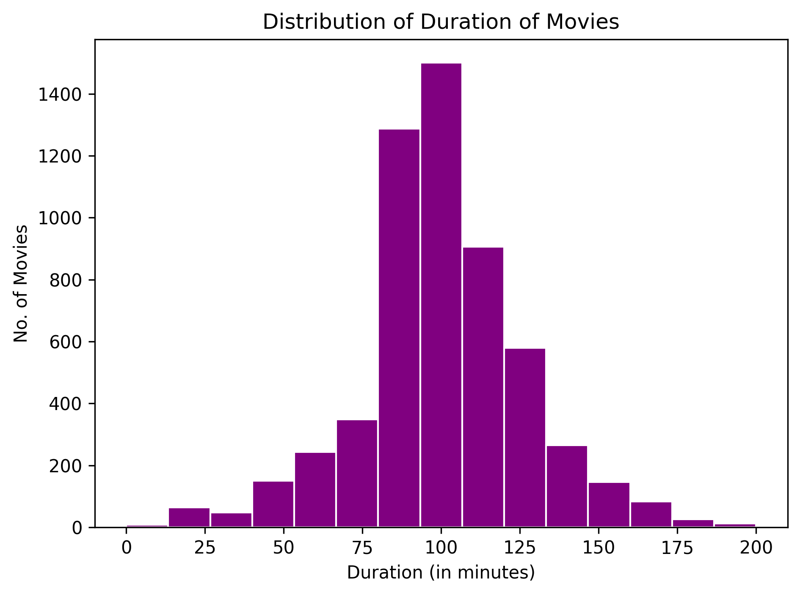

# 🎬 Netflix Data Analysis & Visualization

A comprehensive Exploratory Data Analysis (EDA) on Netflix's movies and TV show catalog. This project analyzes content distribution, genre trends, release years, ratings, and top contributing countries using Python data visualization libraries.

[](https://colab.research.google.com/github/sendisha1808/netflix-eda-and-insights/blob/main/netflix_data_visualization.ipynb)

---

## 📊 Key Highlights & Visuals



### Key Insights
- **Content Ratio:** Breakdown between Movies and TV Shows.
- **Content Growth:** Analysis of how Netflix's library expanded over recent years.
- **Top Genres & Countries:** The dominant genres and primary producing countries on the platform.

---

## 🛠️ Tech Stack & Tools

- **Language:** Python
- **Data Manipulation:** `pandas`, `numpy`
- **Data Visualization:** `matplotlib`, `plotly`
- **Environment:** Google Colab

---

## 📂 Dataset Information

The dataset includes information on movies and TV shows available on Netflix, including:
- `title`: Name of the movie or TV show
- `type`: Content type (Movie or TV Show)
- `director`: Director(s) involved
- `cast`: Main actors/actresses
- `country`: Country of production
- `release_year`: Original release year
- `rating`: Content rating (e.g., TV-MA, PG-13)

---

## 🚀 How to Run

1. **Run directly in Google Colab (Recommended):**
   - Click the **Open in Colab** badge at the top of this README.
   - Run the cells sequentially to execute the code and view the visualizations.

2. Dowmload the `netflix_titles.csv` file into the project folder if it is not already present.

3. **Run locally:**
   ```bash
   git clone [https://github.com/sendisha1808/netflix-eda-and-insights.git](https://github.com/your-username/netflix-eda-and-insights.git)
   cd netflix-data-visualization
   pip install -r requirements.txt
   jupyter notebook netflix_data_visualization.ipynb
